<div align="center">


<a href="https://git.io/typing-svg">
  
</a>

<br/>

<a href="https://didula-gamage.pages.dev/"></a>

<a href="https://github.com/Didula-Gamage99x?tab=followers"></a>


</div>

<br/>

## ⚡ quick intro

```js
const didula = {
  location: "🇱🇰 Sri Lanka",
  role: "Developer & Designer",
  focus: ["Web Dev", "Cybersecurity", "Graphic Design"],
  currentlyLearning: ["SQL", "Python Automation", "Networking", "Cyber Security"],
  funFact: "I like building things that work properly AND look designed on purpose.",
};
```

I work across **web development** and **visual design** building systems in HTML/CSS, JavaScript and C#, and designing the interfaces and brand assets that go with them in Figma and Canva. Alongside that, I take on IT support, website builds & maintenance, and basic cybersecurity hygiene 🔐

<br/>


## 🔥 tech stack

<div align="center">

</div>

<details>
<summary align="center"><b>📊 proficiency breakdown (click to expand)</b></summary>

<br/>

| Skill | Level |
|---|---|
| Canva | ███████████████████░ 95% |
| HTML / CSS | ██████████████████░░ 90% |
| Figma | ██████████████████░░ 90% |
| C# | ██████████████████░░ 90% |
| Web Design | █████████████████░░░ 85% |
| Bootstrap | █████████████████░░░ 85% |
| Kali Linux | █████████████████░░░ 85% |
| SQL | ███████████████░░░░░ 75% |
| Git | ██████████████░░░░░░ 70% |
| JavaScript | █████████████░░░░░░░ 65% |
| Python | █████████████░░░░░░░ 65% |
| Oracle | ███████████░░░░░░░░░ 55% |
| PHP | █████████░░░░░░░░░░░ 45% |

</details>

<br/>

## 📊 github analytics

<div align="center">





</div>

<br/>

## 🚀 selected work

<div align="center">

<table>
<tr>
<td width="50%">

**📸 [Malcolm Lismore Photography](https://github.com/Didula-Gamage99x/Malcolm-Lismore-Photography)** ⭐ 5<br/>
Responsive photography portfolio site for showcasing galleries & services.<br/>
`HTML` `CSS` `JS` `PHP`

</td>
<td width="50%">

**💰 [Payroll Management System](https://github.com/Didula-Gamage99x/Payroll-Management-System)** ⭐ 5<br/>
Automated payroll processing & employee management.<br/>
`C#` `Database` `UI/UX`

</td>
</tr>
<tr>
<td width="50%">

**✋ [Air Drawing Dashboard](https://github.com/Didula-Gamage99x/Air-Drawing-Dashboard)** ⭐ 3<br/>
Draw using hand gestures — interactive, responsive web dashboard.<br/>
`CSS` `JS` `Computer Vision`

</td>
<td width="50%">

**🕵️ [Browser Activity Logger](https://github.com/Didula-Gamage99x/investigator-browser-activity-logger)** ⭐ 2<br/>
Chrome extension logging activity & searches with passcode protection.<br/>
`JavaScript` `Chrome Ext`

</td>
</tr>
<tr>
<td width="50%">

**🔐 [Password Strength Checker](https://github.com/Didula-Gamage99x/password-strength-checker)** ⭐ 2<br/>
Entropy & pattern based password scoring, crack time estimate + generator.<br/>
`HTML` `CSS` `JS`

</td>
<td width="50%">

**🛰️ [Sx9Net Info](https://github.com/Didula-Gamage99x/Sx9Net-Info)** ⭐ 2<br/>
Network scanner for gathering net details, built for Kali users.<br/>
`Shell` `Networking`

</td>
</tr>
</table>

<details>
<summary><b>🎬 also worth a look</b></summary>
<br/>

| project | what it does |
|---|---|
| 🏫 Preschool Management System | End to end admin & operations system for preschools — `HTML/CSS` `JS` `C#` |
| 🎬 Quiet Attic Films — Booking System | Film booking & management system with a clean UI — `C#` `Database` `UI/UX` |

</details>

</div>

<br/>

## 🌐 let's connect

<div align="center">

<a href="https://didula-gamage.pages.dev/"></a>
<a href="https://www.linkedin.com/in/didula-gamage-8b8412339"></a>
<a href="https://www.instagram.com/didula.gamage"></a>
<a href="mailto:didulagamagee@gmail.com"></a>

</div>

<br/>

<div align="center">


<sub>💬 <b>available for projects</b> &nbsp;•&nbsp; 📍 Sri Lanka &nbsp;•&nbsp; © 2026 Didula Gamage</sub>
</div>
